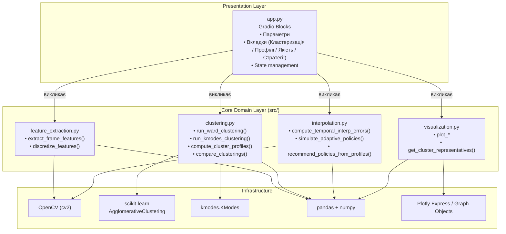
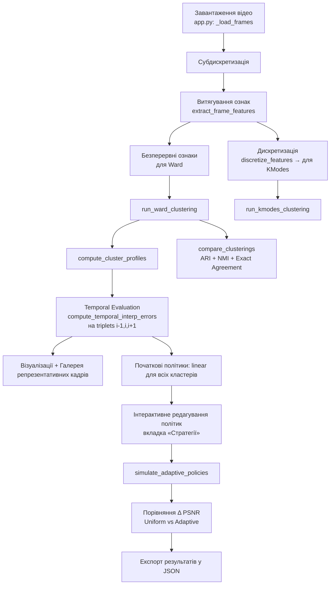
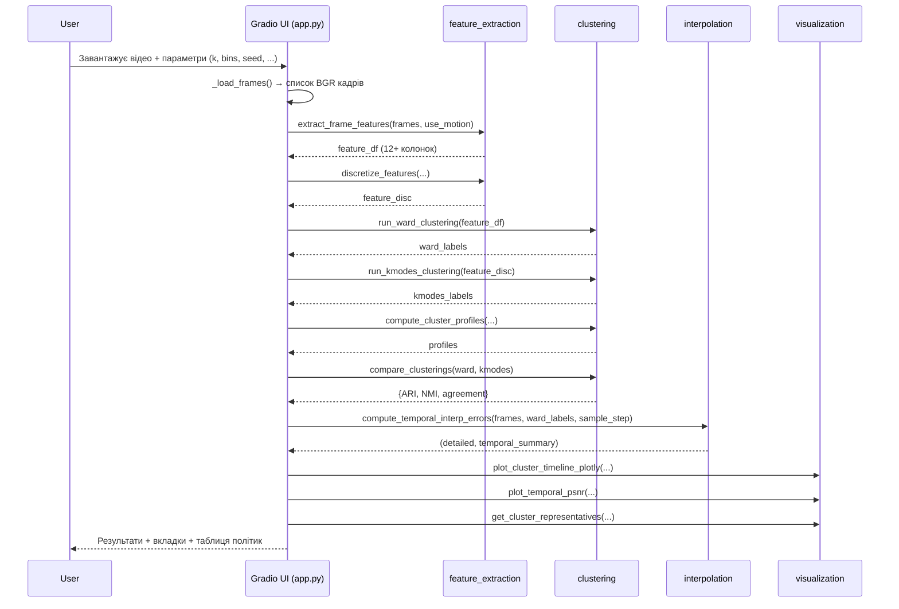
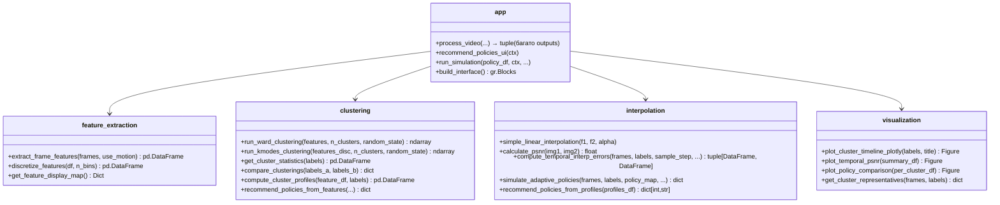
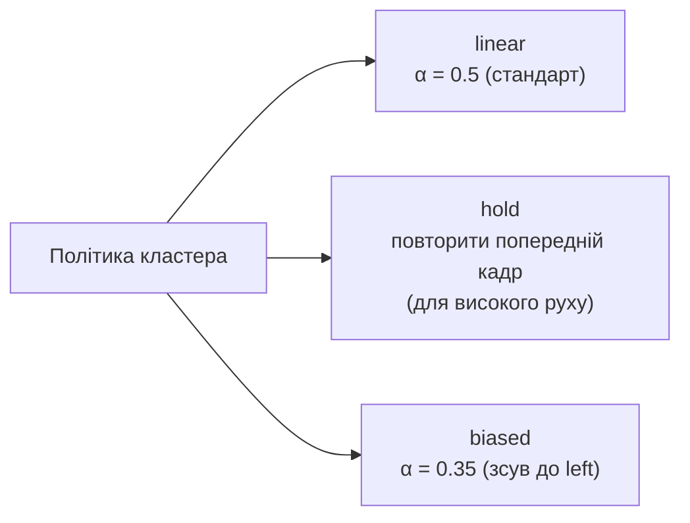

# Архітектура та дизайн проєкту

**Адаптивна інтерполяція відео на основі model-based кластеризації**

Це документ описує структуру, компоненти, потоки даних та ключові дизайнерські рішення проєкту у стилі UML-діаграм (з використанням Mermaid для рендеру в GitHub / VS Code / Markdown viewers).

---

## 1. Огляд проєкту

Проєкт реалізує **контент-адаптивну** систему інтерполяції кадрів відео. 

Основна ідея:
- Класична лінійна інтерполяція погано працює на складному контенті (швидкий рух, текстура, зміни яскравості).
- Застосовується **model-based кластеризація** (Ward + KModes) для автоматичного виявлення типів контенту.
- Для кожного кластера обирається своя **політика інтерполяції** (`linear`, `hold`, `biased`).

Оцінка якості — **тільки на часовій структурі** (temporal triplets `i-1, i, i+1`), а не на випадкових парах.

---

## 2. Структура директорій

```
video_Interpolation_course_w/
├── app.py                      # Точка входу. Gradio UI (весь інтерфейс)
├── requirements.txt
├── README.md
├── pack_for_share.py           # Утиліта для створення легкого ZIP-архіву
│
├── src/                        # Бізнес-логіка (ядро)
│   ├── feature_extraction.py   # Витягування ознак + дискретизація
│   ├── clustering.py           # Ward, KModes, порівняння, профілі кластерів
│   ├── interpolation.py        # Temporal PSNR + симуляція адаптивних політик
│   └── visualization.py        # Побудова графіків (Plotly + matplotlib)
│
├── tests/
│   └── test_core_logic.py      # Unit-тести ключової логіки
│
└── docs/
    └── architecture.md         # Цей документ
```

---

## 3. Компонентна діаграма (Component Diagram)



---

## 4. Діаграма потоків даних (Data Flow)



---

## 5. Sequence Diagram — Основний пайплайн аналізу



---

## 6. Діаграма класів / модулів (Class Diagram style)

Оскільки проєкт написаний у функціональному стилі (не важкий ООП), діаграма показує основні функції як операції модулів.



---

## 7. Ключові структури даних

| Структура | Де використовується | Опис |
|-----------|---------------------|------|
| `frames: list[np.ndarray]` | app, interpolation, visualization | Список BGR кадрів (після ресайзу) |
| `feature_df: pd.DataFrame` | feature_extraction → clustering | Колонки: `frame_idx`, `mean_*`, `std_*`, `brightness`, `contrast`, `texture_laplacian`, `motion_*` |
| `feature_disc: pd.DataFrame` | discretize_features | Ті самі колонки, але значення — категорії 0..n_bins-1 (int) |
| `labels: np.ndarray[int]` | Всюди | Мітки кластерів (0..k-1) для кожного кадру |
| `profiles: pd.DataFrame` | clustering → app | `cluster`, `size`, `{feature}_mean`, `{feature}_std` |
| `temporal_summary: pd.DataFrame` | interpolation | `Кластер`, `Середній PSNR (temporal)`, `Std PSNR`, ... |
| `policy_map: dict[int, str]` | interpolation | `{cluster_id: "linear" \| "hold" \| "biased"}` |
| `ctx (Gradio State)` | app.py | Зберігає `frames`, `ward_labels`, `profiles`, `sample_step`, `random_seed` між кліками |

---

## 8. Підтримувані політики інтерполяції



- **linear** — базова лінійна інтерполяція.
- **hold** — консервативна стратегія при високому русі/текстурі (уникає артефактів).
- **biased** — проміжний варіант.

---

## 9. Дизайнерські рішення та принципи

1. **Два незалежні кластеризації** (Ward на неперервних ознаках + KModes на дискретних) — для крос-валідації.
2. **Temporal-only evaluation** — оцінка тільки на реальних послідовних triplet'ах (науково коректніше).
3. **Інтерпретованість** — профілі кластерів + прості правила рекомендацій замість чорного ящика.
4. **Gradio State** — дозволяє зберігати важкі дані (кадри) між різними вкладками без повторного завантаження відео.
5. **Поділ на чисті функції** — кожен модуль `src/` легко тестується (див. `tests/test_core_logic.py`).
6. **Мінімалізм** — немає глибокого навчання, тільки класичні алгоритми курсу.

---

## 10. Як розширювати проєкт (рекомендації)

- Додати нові ознаки → `feature_extraction.py`
- Додати новий алгоритм кластеризації → `clustering.py` + оновити `compare_clusterings`
- Додати нову політику → `interpolation.py` (`simulate_adaptive_policies`) + UI
- Покращити візуалізацію → `visualization.py`
- Додати нові тести → `tests/test_core_logic.py`

---

## 11. Запуск тестів

```bash
pytest tests/ -q
```

---

*Документ згенеровано для курсового проєкту. Оновлюйте діаграми при зміні архітектури.*
