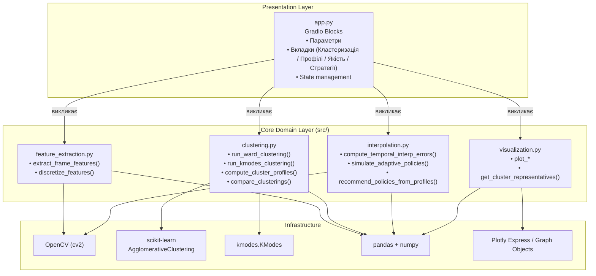

```mermaid
graph TD
    subgraph Presentation["Presentation Layer"]
        direction TB
        GradioUI["app.py<br/>Gradio Blocks<br/>• Параметри<br/>• Вкладки (Кластеризація / Профілі / Якість / Стратегії)<br/>• State management"]
    end

    subgraph Core["Core Domain Layer (src/)"]
        direction LR
        FE["feature_extraction.py<br/>• extract_frame_features()<br/>• discretize_features()"]
        CL["clustering.py<br/>• run_ward_clustering()<br/>• run_kmodes_clustering()<br/>• compute_cluster_profiles()<br/>• compare_clusterings()"]
        IP["interpolation.py<br/>• compute_temporal_interp_errors()<br/>• simulate_adaptive_policies()<br/>• recommend_policies_from_profiles()"]
        VIS["visualization.py<br/>• plot_*<br/>• get_cluster_representatives()"]
    end

    subgraph Infrastructure["Infrastructure"]
        OpenCV["OpenCV (cv2)"]
        SK["scikit-learn<br/>AgglomerativeClustering"]
        KM["kmodes.KModes"]
        Pandas["pandas + numpy"]
        Plotly["Plotly Express / Graph Objects"]
    end

    GradioUI -->|викликає| FE
    GradioUI -->|викликає| CL
    GradioUI -->|викликає| IP
    GradioUI -->|викликає| VIS

    FE --> OpenCV
    FE --> Pandas
    CL --> SK
    CL --> KM
    CL --> Pandas
    IP --> OpenCV
    IP --> Pandas
    VIS --> Plotly
    VIS --> Pandas
```